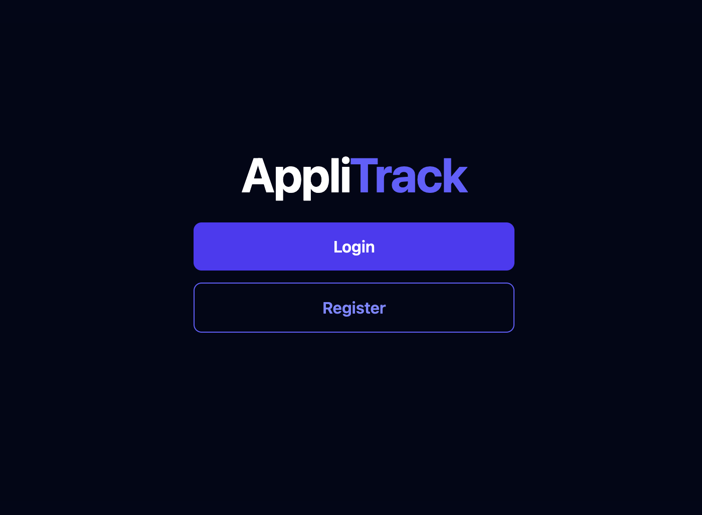
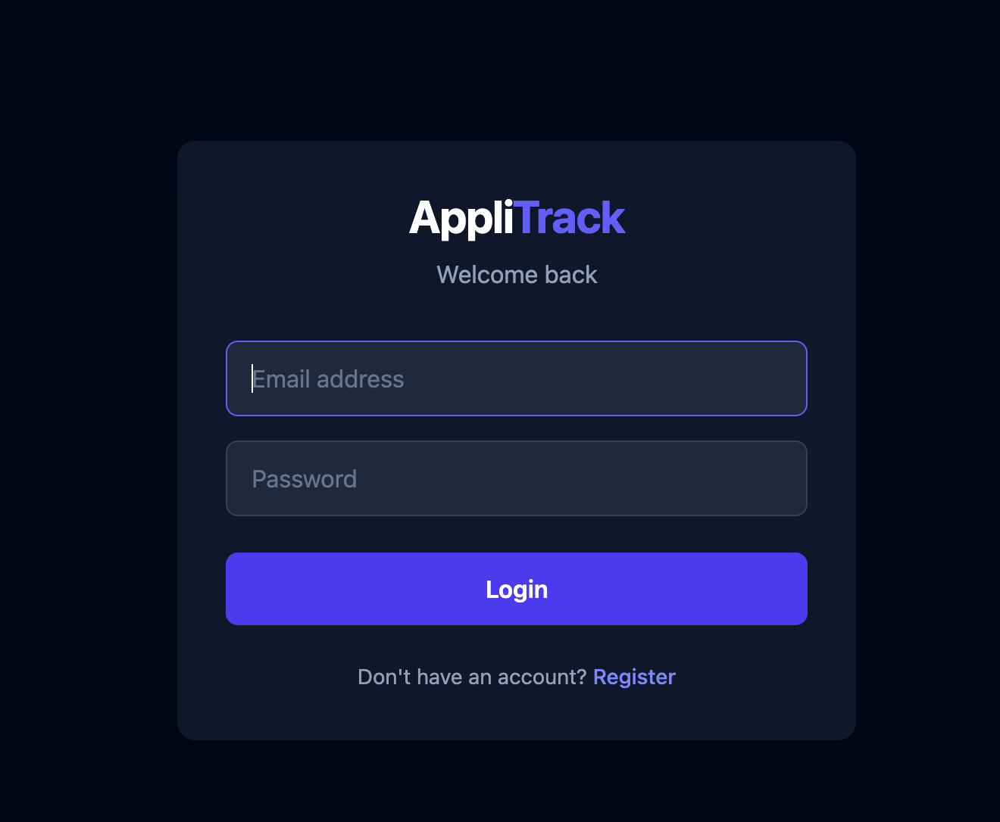
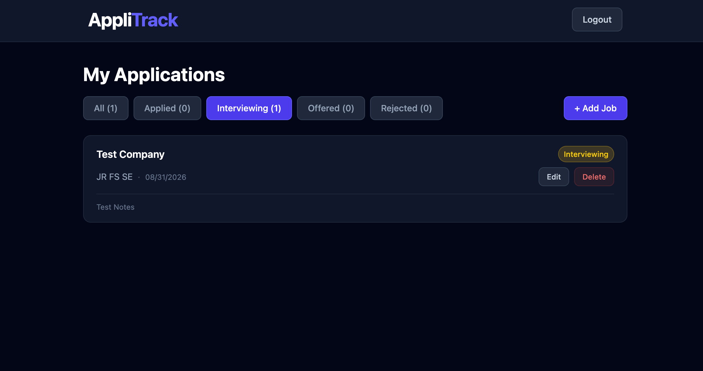

# Applitrack

This full-stack MERN application helps job seekers track and manage their employment applications in one place. Users can organize applications by status and add notes to keep important details readily accessible.

**Live Demo:** [applitrack-khaki.vercel.app](https://applitrack-khaki.vercel.app)

## Screenshot

## About

I built this application to solve a real problem I expect to face during my upcoming software engineering job search. Keeping track of applications, interview stages, and important notes can quickly become difficult, so I wanted a centralized tool to stay organized. This project also serves as a portfolio piece that demonstrates my ability to design, build, and deploy a full-stack MERN application using modern web development practices.

## Tech Stack

Backend
Node.js – JavaScript runtime used to run the backend server.
Express.js – Handles API routes, middleware, and business logic.
dotenv – Manages environment variables and application secrets.
CORS – Enables secure communication between the frontend and backend running on different origins.

Database
MongoDB – Stores user accounts and job application data.
Mongoose – Provides schema modeling and database interaction for MongoDB.

Authentication & Security
JSON Web Token (JWT) – Implements secure, stateless authentication for protected routes.
bcryptjs – Hashes user passwords before they are stored in the database.

Frontend
React – Builds the user interface and manages application state.
Axios – Handles HTTP requests between the frontend and backend APIs.
Tailwind CSS – Utility-first CSS framework used for responsive styling.
Vite – Frontend build tool and development server for a fast development experience.

Deployment
Render – Cloud platform used to deploy the backend API.
Vercel – Cloud platform used to deploy the frontend application.
Resend - Email delivery service used to send application-related notifications and alerts to users.

## Features

- Secure user registration and login with JWT authentication
- Protected routes and user-specific data access
- Create, view, update, and delete job applications
- Track application progress through customizable statuses
- Add notes for interviews, recruiters, and follow-up actions
- Filter applications by status with live application counts
- Responsive design for desktop, tablet, and mobile devices
- Email notifications when application status changes to Interviewing, Offered, or Rejected

## Getting Started (How to run locally)

Prerequisites

- Node.js
- MongoDB Atlas account

Clone the repo

- git clone https://github.com/jamesvk/applitrack.git

Backend setup

- cd backend
- npm install
- create .env file with MONGO_URI, JWT_SECRET, PORT , RESEND_API_KEY
- npm run dev

Frontend setup

- cd frontend
- npm install
- create .env with VITE_API_URL
- npm run dev

## Challenges

The biggest challenge was understanding the full flow of data throughout the application as more features were added. With multiple technologies working together, it was sometimes difficult to keep track of how requests, responses, and data moved between the frontend, backend, and database. Similar syntax across different libraries and frameworks also added to the learning curve. I overcame this by breaking the project into smaller pieces, focusing on one concept at a time, and revisiting earlier topics when needed to reinforce my understanding as the codebase grew.

## Future Improvements

- HTTP-only cookies for JWT storage instead of localStorage
- Token refresh mechanism
- Password reset functionality
