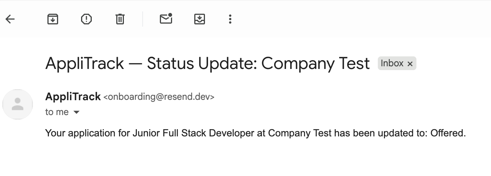

# AppliTrack

**AppliTrack** is a full-stack MERN application that helps job seekers organize, track, and manage their job applications in one place.

**Live Demo:** [applitrack-khaki.vercel.app](https://applitrack-khaki.vercel.app)
⚠️ The backend is hosted on Render's free tier and may take 30–60 seconds to wake up after a period of inactivity. Please allow a moment for the server to respond on first load.

---

## Screenshots

| Login                        | Dashboard                            | Email Notification                                     |
| ---------------------------- | ------------------------------------ | ------------------------------------------------------ |
|  |  |  |

---

## About

I built AppliTrack to solve a problem I knew I would face during my software engineering job search. Managing job applications across spreadsheets, emails, and browser tabs is messy — I wanted a single, purpose-built tool to stay organized. This project also serves as a portfolio piece demonstrating my ability to design, build, and deploy a complete full-stack application with real-world features like JWT authentication and transactional email notifications.

---

## Tech Stack

**Backend**

- **Node.js** — JavaScript runtime for the server-side application.
- **Express** — Handles API routing, middleware, and request processing.
- **dotenv** — Loads environment variables from `.env` files to keep secrets out of source code.
- **CORS** — Configures cross-origin policies so the frontend and backend can communicate across different domains.

**Database**

- **MongoDB Atlas** — Cloud-hosted NoSQL database for storing users and job application records.
- **Mongoose** — Schema-based ODM that structures and validates MongoDB documents.

**Auth & Security**

- **JWT** — Issues signed tokens for stateless, secure user authentication on protected routes.
- **bcryptjs** — Hashes passwords before storage so plaintext credentials are never persisted.
- **Resend** — Transactional email service that delivers status-change notifications to users.

**Frontend**

- **React** — Component-based UI library for building the interactive dashboard.
- **Vite** — Fast build tool and development server with hot module replacement.
- **Tailwind CSS** — Utility-first CSS framework for responsive, consistent styling.
- **Context API** — Manages global authentication state without a third-party library.

**Deployment**

- **Render** — Hosts the Express backend API.
- **Vercel** — Hosts the React frontend with automatic deployments from Git.

---

## Features

- Secure user registration and login with JWT authentication
- Full job application CRUD — create, view, edit, and delete entries
- Status management to track where each application stands
- Email notifications via Resend when an application moves to Interviewing, Offered, or Rejected
- Filter applications by status with live counts per category
- Responsive design across desktop, tablet, and mobile

---

## Getting Started

### Prerequisites

- Node.js v18+
- MongoDB Atlas account
- Resend account (for email notifications)

### Clone the repo

```bash
git clone https://github.com/jamesvk/applitrack.git
cd applitrack
```

### Backend setup

```bash
cd backend
npm install
```

Create a `.env` file in the `backend` directory:

```env
PORT=5000
MONGO_URI=your_mongodb_atlas_connection_string
JWT_SECRET=your_jwt_secret
NODE_ENV=development
CLIENT_URL=http://localhost:5173
RESEND_API_KEY=your_resend_api_key
FROM_EMAIL=your_verified_sender@example.com
```

```bash
npm run dev
```

### Frontend setup

```bash
cd frontend
npm install
```

Create a `.env` file in the `frontend` directory:

```env
VITE_API_URL=http://localhost:5000
```

```bash
npm run dev
```

---

## Future Improvements

- Mobile app for tracking applications on the go
- Calendar integration to surface upcoming interviews and deadlines
- Interview prep notes linked directly to each application
- Analytics dashboard with charts for application volume and conversion rates

---

## Author

**James Kim**
GitHub: [github.com/jamesvk](https://github.com/jamesvk)
